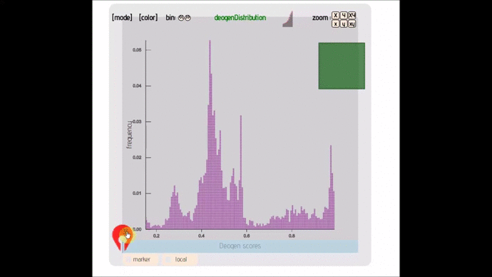
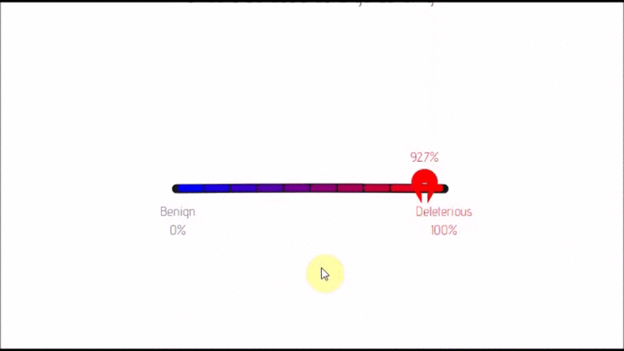
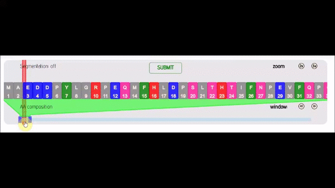
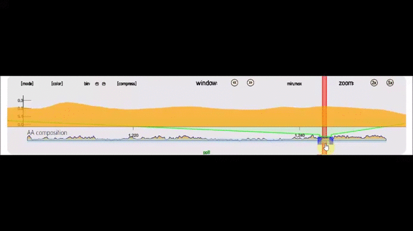
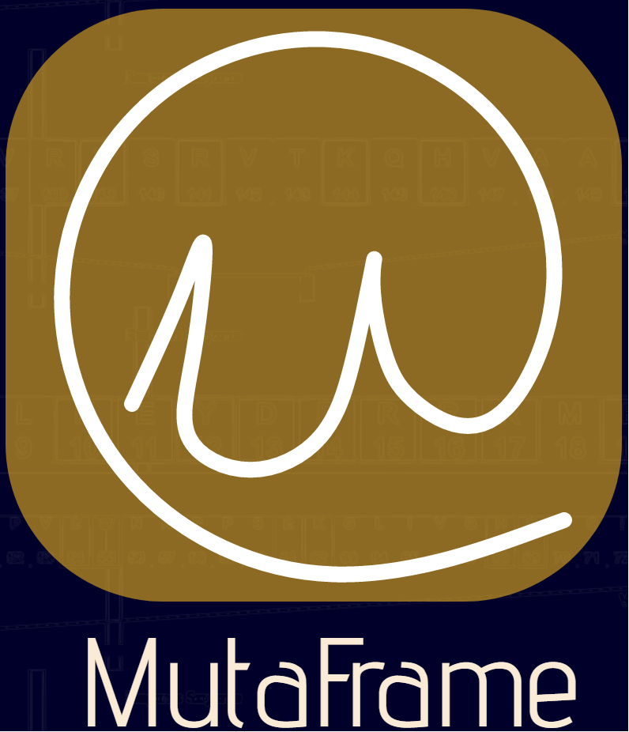
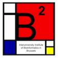

# Lexicon

----
</img>
  
>_**Breya:** Why are all these metal... things... ignoring us?_  
>_**'The Voice':** Every age it seems, is tainted by the greed of men..._  
 
## What is it? 

LEXICON is a collection of high level javascript libraries to create interactive and synchronizable graphs and dashboards. I am updating these pages slowly.

## White papers, white papers..Blood & Tears

Below is a list of publications that contributed to this project.

#### DEOGEN2: About a year old project. It is a machine learning based prediction software for human mutations. We used about half of the visualization modules here for this project (A.K.A Mutaframe):
- https://academic.oup.com/nar/article/45/W1/W201/3819233
#### I-PV: 4-5 year old project. Circular visualization that combines vanilla Javascript, D3 and Circos. Perhaps it is one of the largest project built with D3. Not the best coding quality but unique for sure. You think I am wrong? Submit me a challenger and I will post it here. Seriously.
- https://www.ncbi.nlm.nih.gov/pubmed/26454277
#### Indoril: 2 year old project. One of the first svg based 3D rendering modules built on top of I-PV. You think other tools does this already (filter variants && map them && renormalize scores && format based on amino acid && brush through domains && render)? Submit me a link with a similar project and its outcome and I will post it RIGHT here.
- https://www.biorxiv.org/content/early/2017/06/09/148122

## The Story

>About a year ago I started working on the [Mutaframe][MUTAFRAME] project where we developed a data-visualization platform for all variants of the Human Genome:
- more then 30 000 proteins
- approximately 8000 points mutations for each protein

>We tried concepts that has not been tried in bioinformatics such as:
- dedicated visualizations for submitting mutations for medical doctors & researchers
- displaying all variants at once from a protein and looking at AUC
- JS visualization components that can be synchronized with each other (I am not talking about a chart update, neither plain transform of one g group/svg with some gesture.)

>To be able to do these, I needed components that can exactly do what I want. So I wrote a whole library of components from scratch using vanilla JS and D3:
- If you want to have an idea of whats going on take a look at my recent talk at [ECCB2017][ECCB2017]
- If you want to see what it can do, have a look at the [mutaframe][mutaframe] website.  
- If you want to follow updates you can do it from [here][myTwitter] and [here][mutaframeTwitter].  

>There are currently 8 libraries (components or whatever you want to call them). Each has or will have their own repository & Gists:

- lexicon-rainbow ([Github][RAINBOW]; [🔍](https://github.com/IbrahimTanyalcin/lexicon-rainbow)) :: Parallel Coordinates/Sankey with business logic embedded in JSON only.
  - [Gist1][RAINBOW_G1]
  - [Gist2][RAINBOW_G2]
  - [Gist3][RAINBOW_G3]
  - [Gist4][RAINBOW_G4]
  - [Gist5][RAINBOW_G5]
  - [Gist6][RAINBOW_G6]
  

- lexicon-distribute (; [🔍](./dev/lexiconDistribute.js)) :: Distribution graph that allows you to change bin size, see individual points and AUC. Can handle up to 50 000 points.
  - [Gist1][DISTRIBUTE_G1]
  - [Gist2][DISTRIBUTE_G2]
  

- lexicon-dash(; [🔍](./dev/lexiconDash.js)) :: Dash board that can transfrom between 2 layouts. Comes with nify and automatic label placement.
  - [Gist1][DASH_G1]
  

- lexicon-seq(; [🔍](./dev/lexiconSeq_dev_test.js)) :: A Visualization module for string of sequences.

- lexicon-plot(; [🔍](./dev/lexiconPlot_dev_test.js)) :: Similar to lexicon seq but instead it plots a line graph with bin options and other transforms

- lexicon-ss(;[🔍][./dev/lexiconSS_dev_test.js]) :: A dedicated lexicon-plot version for protein secondary structure

- lexicon-simplex(; [🔍](./dev/lexiconSimplex.js)) :: Strippted down version of a ordinal bar/scatter plot with adjustable ranges.

- lexicon-compare(; [🔍](./dev/lexiconCompare_dev.js)) :: A 3D perspective plot that compares 2 lexicon instances.
Beware that this is not a 3D renderer. If you are looking for one in pure SVG, I have written one 2.5 years ago for [this](http://i-pv.org/) project and in [this](https://www.biorxiv.org/content/early/2017/06/09/148122.article-metrics) whitepaper. 

## What are the advantages?

- Lexicon libraries are old school. Drop the script tag and you are good to go. Some of the libraries like [lexicon-rainbow](https://github.com/IbrahimTanyalcin/lexicon-rainbow/blob/master/dev/lexiconRainbow.d3v4.dev.js) are wrapped inside UMD.
If you are also looking for an old school module manager, try [taskq](https://github.com/IbrahimTanyalcin/taskq) and help me make it better :)
- You can synchronize some of the modules with each other allowing you to build complex applications.
- Dependencies ? D3 and good old vanilla 'Rex' ES5. What else ? NONE.
- Instances have their methods privately. I rarely use the prototype. JS engines are changing fast. At the time I started lexicon, access to private methods were faster. So as a result:
    - current libraries are not the most memory efficient but they should be fast. (And it is *very very very* unlikely that the bottle neck will be the extra few bytes from methods of multiple instances. Probably it will be your beloved DOM nodes, as always.)
	- I might rewrite a more prototype reliant version depending on the JS engines (chrome especially)

## Usage

For usage, refer to the individual repository for the module you liked (if exists at the moment). Or take a look at the gists if possible. 

## Issues

**lexicon-distribute**
- When you mouse over single elements the label will trigger mouseout. I might use *node.contains* or *event.relatedTarget* check to ignore mouse out. I will fix that in the next patch.
- ie 9 does not show the Joystic to reset, at least that's what some people told me. I might reconsider moving it to the right all together.
- There are some performance issues when the node count is > 20000. I have some ideas at hand. Expect some nifty updates.

**lexicon-seq**
- I realized I have re-bound the data within the render function to the selection rather than storing the selection it self (eventhough the D3 version is v3 and selections silently update after *enter* unlike v4).
I cannot quite recall why I did that. Rule #1: 'Do no harm'. So I will modify those parts once I'm sure it's not gonna break anything.

## Lisence

Lisenced under [**GPL**](./LISENCE.md) for Academic or Non-profit use only. It is dual licensed for commercial applications.
Certain components have registered IP property rights, contact me if you have questions.
 
## Acknowledgement

* Projects
  * The Mutaframe ([][MUTAFRAME]) project, started in 2016 aims to be a visualization platform for mutations in human proteome (single nucleotide variants on coding regions of the human genome)
  that is guided by machine learning. What was unique about the project is that, it's not just about visualization of any data, it is related to healthcare. Several tools that is developed during this project (including this one) can also be used for generic purpose.
  I will document and release these tools as I sieze the opportunity.
* Organizations
  *  for a fruitfull project that lead to development of [Mutaframe][MUTAFRAME] and many other micro libraries.
  *  for coordinating funds for the [Mutaframe][MUTAFRAME] project which eventually lead to development
  of many small libraries including this one.
  *  for funding the [Mutaframe][MUTAFRAME] project.

## Support

Just a small reminder:
- I work under the Academic umbrella, it's not always the easiest to promote the work when I have to do several other things.
- I am not backed up by some 'firm' or some big whale 'name'. 
- Therefore I don't have xk followers on Twitter.
- Consequently not a lot of people can hear about the project, nor support it.
- I don't like bandwagon, and I suspect bandwagon has similar sentiments.
- I believe data visualization should be much more than just copying/pasting code and making small modifications.
- I see people extending already existing components and adding glue code around and then promote it as a framework---> I think we should go back to basics, an optimally low level and try get the best out of existing SVG spec etc.
- Above is a time consuming process.

So if you would like to show your support for this project you can contribute to my general **[PATREON](https://www.patreon.com/ibrahimTanyalcin)** page.

You cannot? It's ok. Do you find it useful? Then please consider starring this repository -> **motivation does not hurt**.

Thank You!

Ibrahim Tanyalcin PhD

[MINIMAL]: http://bl.ocks.org/ibrahimtanyalcin/6e2e775cb954ecf89e6b379b5fa4c510
[AMINOACIDS]: http://bl.ocks.org/ibrahimtanyalcin/3ec054bc6dc485c46631c5ef1d28dbe9
[RANDOMDATA]: http://bl.ocks.org/ibrahimtanyalcin/35d404d513420d84570eb0a418c87856
[SERVER]: http://bl.ocks.org/ibrahimtanyalcin/2e478e178470c385656a90d3a4629220
[VOTES]: http://bl.ocks.org/ibrahimtanyalcin/f0bf54f88c6859c985ee98bc5e56ae6f
[MUTAFRAME]: http://deogen2.mutaframe.com/
[PROGRAMMATIC]: http://bl.ocks.org/ibrahimtanyalcin/f2067bef081d84b85e3fb077f3272a90
[PROTEIN]:http://bl.ocks.org/ibrahimtanyalcin/37c3e06f97cda2881acbfcbb4d77e3ab
[mutaframe]: <http://deogen2.mutaframe.com/>
[myTwitter]: <https://twitter.com/ibrhmTanyalcin>
[mutaframeTwitter]: <https://twitter.com/MutaFrame>
[ECCB2017]: https://www.youtube.com/watch?v=9UGcxoZ0l2o
[RAINBOW]: https://github.com/IbrahimTanyalcin/lexicon-rainbow
[RAINBOW_G1]: http://bl.ocks.org/ibrahimtanyalcin/37c3e06f97cda2881acbfcbb4d77e3ab
[RAINBOW_G2]: http://bl.ocks.org/ibrahimtanyalcin/6e2e775cb954ecf89e6b379b5fa4c510
[RAINBOW_G3]: http://bl.ocks.org/ibrahimtanyalcin/3ec054bc6dc485c46631c5ef1d28dbe9
[RAINBOW_G4]: http://bl.ocks.org/ibrahimtanyalcin/2e478e178470c385656a90d3a4629220
[RAINBOW_G5]: http://bl.ocks.org/ibrahimtanyalcin/f0bf54f88c6859c985ee98bc5e56ae6f
[RAINBOW_G6]: https://bl.ocks.org/ibrahimtanyalcin/f2067bef081d84b85e3fb077f3272a90
[DISTRIBUTE_G1]: https://bl.ocks.org/ibrahimtanyalcin/c2213de41fbc968b210ad6a8aae77a0f
[DISTRIBUTE_G2]: https://bl.ocks.org/ibrahimtanyalcin/e0046de6e51cb126d544b92e26e0cf62
[DASH_G1]: https://bl.ocks.org/ibrahimtanyalcin/808237e5729ba4720f437fda4eab8085
