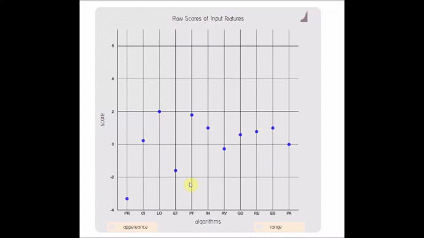

# Lexicon

----
</img>
  
>_**Breya:** Why are all these metal... things... ignoring us?_  
>_**'The Voice':** Every age it seems, is tainted by the greed of men..._  

  
 
## What is it? 

LEXICON is a collection of high level javascript libraries to create interactive and synchronizable graphs and dashboards. I am updating these pages slowly.

## The Story

>About a year ago I started working on the [Mutaframe][MUTAFRAME] project where we developed a data-visualization platform for all variants of the Human Genome:
- more then 30 000 proteins
- approximately 8000 points mutations for each protein
>We tried concepts that has not been tried in bioinformatics such as:
- dedicated visualizations for submitting mutations for medical doctors & researchers
- displaying all variants at once from a protein and looking at AUC
- JS visualization components that can be synchronized with each other (I am not talking about a chart update, neither plain transform of one g group/svg with some gesture.)
>To be able to do these, I needed components that can exactly do what I want. So I wrote a whole library of components from scratch using vanilla JS and D3:
- If you want to have an idea of whats going on take a look at my recent talk at [ECCB2017][ECCB2017]
- If you want to see what it can do, have a look at the [mutaframe][mutaframe] website.  
- If you want to follow updates you can do it from [here][myTwitter] and [here][mutaframeTwitter].  
>There are currently 8 libraries (components or whatever you want to call them). Each has or will have their own repository & Gists:

- lexicon-rainbow ([Github][RAINBOW];[🔍][https://github.com/IbrahimTanyalcin/lexicon-rainbow]) :: Parallel Coordinates/Sankey with business logic embedded in JSON only.
  - [Gist1][RAINBOW_G1]
  - [Gist2][RAINBOW_G2]
  - [Gist3][RAINBOW_G3]
  - [Gist4][RAINBOW_G4]
  - [Gist5][RAINBOW_G5]
  - [Gist6][RAINBOW_G6]

- lexicon-distribute(;[🔍][./dev/lexiconDistribute.js]) :: Distribution graph that allows you to change bin size, see individual points and AUC. Can handle up to 50 000 points.
  - [Gist1][DISTRIBUTE_G1]
  - [Gist2][DISTRIBUTE_G2]

- lexicon-dash(;[🔍][./dev/lexiconDash.js]) :: Dash board that can transfrom between 2 layouts. Comes with nify and automatic label placement.
  - [Gist1][DASH_G1]

- lexicon-seq(;[🔍][./dev/lexiconSeq_dev_test.js]) :: A Visualization module for string of sequences.

- lexicon-plot(;[🔍][./dev/lexiconPlot_dev_test.js]) :: Similar to lexicon seq but instead it plots a line graph with bin options and other transforms
- lexicon-ss(;[🔍][./dev/lexiconSS_dev_test.js]) :: A dedicated lexicon-plot version for protein secondary structure

- lexicon-simplex(;[🔍][./dev/lexiconSimplex.js]) :: Strippted down version of a ordinal bar/scatter plot with adjustable ranges.

- lexicon-compare(;[🔍][./dev/lexiconCompare_dev.js]) :: A 3D perspective plot that compares 2 lexicon instances.

## Coming Soon...
    

## Lisence
----

Lisenced under [*GPL*](./LISENCE.md) for Academic or Non-profit use only. It is dual licensed for commercial applications.
Certain components have registered IP property rights, contact me if you have questions.

  
 
## Acknowledgement
----
* Projects
  * The Mutaframe ([][MUTAFRAME]) project, started in 2016 aims to be a visualization platform for mutations in human proteome (single nucleotide variants on coding regions of the human genome)
  that is guided by machine learning. What was unique about the project is that, it's not just about visualization of any data, it is related to healthcare. Several tools that is developed during this project (including this one) can also be used for generic purpose.
  I will document and release these tools as I sieze the opportunity.
* Organizations
  *  for a fruitfull project that lead to development of [Mutaframe][MUTAFRAME] and many other micro libraries.
  *  for coordinating funds for the [Mutaframe][MUTAFRAME] project which eventually lead to development
  of many small libraries including this one.
  *  for funding the [Mutaframe][MUTAFRAME] project.

## Support
I work on several small to medium sized projects. Development in one can also lead to development of the others. So if you would like to show your
support for this project you can contribute to my [PATREON](https://www.patreon.com/ibrahimTanyalcin) page.

 

[MINIMAL]: http://bl.ocks.org/ibrahimtanyalcin/6e2e775cb954ecf89e6b379b5fa4c510
[AMINOACIDS]: http://bl.ocks.org/ibrahimtanyalcin/3ec054bc6dc485c46631c5ef1d28dbe9
[RANDOMDATA]: http://bl.ocks.org/ibrahimtanyalcin/35d404d513420d84570eb0a418c87856
[SERVER]: http://bl.ocks.org/ibrahimtanyalcin/2e478e178470c385656a90d3a4629220
[VOTES]: http://bl.ocks.org/ibrahimtanyalcin/f0bf54f88c6859c985ee98bc5e56ae6f
[MUTAFRAME]: http://deogen2.mutaframe.com/
[PROGRAMMATIC]: http://bl.ocks.org/ibrahimtanyalcin/f2067bef081d84b85e3fb077f3272a90
[PROTEIN]:http://bl.ocks.org/ibrahimtanyalcin/37c3e06f97cda2881acbfcbb4d77e3ab
[mutaframe]: <http://deogen2.mutaframe.com/>
[myTwitter]: <https://twitter.com/ibrhmTanyalcin>
[mutaframeTwitter]: <https://twitter.com/MutaFrame>
[ECCB2017]: https://www.youtube.com/watch?v=9UGcxoZ0l2o
[RAINBOW]: https://github.com/IbrahimTanyalcin/lexicon-rainbow
[RAINBOW_G1]: http://bl.ocks.org/ibrahimtanyalcin/37c3e06f97cda2881acbfcbb4d77e3ab
[RAINBOW_G2]: http://bl.ocks.org/ibrahimtanyalcin/6e2e775cb954ecf89e6b379b5fa4c510
[RAINBOW_G3]: http://bl.ocks.org/ibrahimtanyalcin/3ec054bc6dc485c46631c5ef1d28dbe9
[RAINBOW_G4]: http://bl.ocks.org/ibrahimtanyalcin/2e478e178470c385656a90d3a4629220
[RAINBOW_G5]: http://bl.ocks.org/ibrahimtanyalcin/f0bf54f88c6859c985ee98bc5e56ae6f
[RAINBOW_G6]: https://bl.ocks.org/ibrahimtanyalcin/f2067bef081d84b85e3fb077f3272a90
[DISTRIBUTE_G1]: https://bl.ocks.org/ibrahimtanyalcin/c2213de41fbc968b210ad6a8aae77a0f
[DISTRIBUTE_G2]: https://bl.ocks.org/ibrahimtanyalcin/e0046de6e51cb126d544b92e26e0cf62
[DASH_G1]: https://bl.ocks.org/ibrahimtanyalcin/808237e5729ba4720f437fda4eab8085
